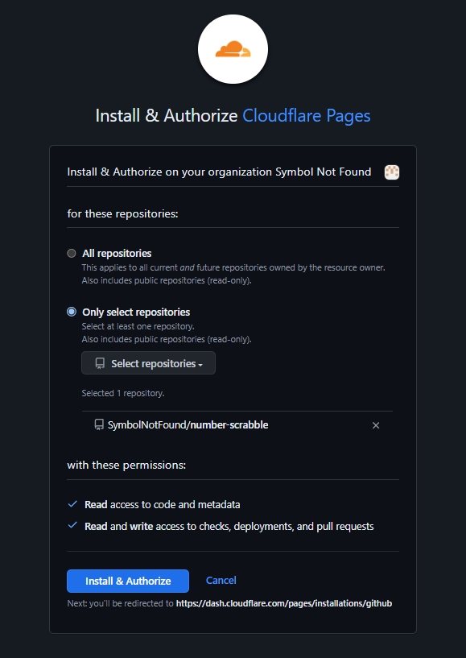

# Using Cloudflare Pages

Cloudflare has an internal workflow that sets up GitHub Pages alongside their Pages product.
There are several benefits to
this, notably that it works nicely with Cloudflare's Workers product so that
you can combine github (stateless) with a stateful server backend to get both
sets of features.  It also makes it very easy to see a preview of your site
before it's deployed, and a convenient way to surface that within a PR, too.
You can always preview your changes locally, but making them visible to a code
reviewer is not usually as easy, but immensely useful.

Setting it up is as easy as connecting your GitHub repository to Clouldflare,
see [their instructions](https://developers.cloudflare.com/pages/get-started/git-integration/)
for how to do it.  It involves filling out an auth
form on Cloudflare's website to provide them with a token to authenticate from.  They don't get to act as you beyond the
permissions to the repository that you've granted them, and you can always
disconnect Cloudflare by revoking the auth token within GitHub's settings
(see [GitHub docs about reviewing OAuth apps](https://docs.github.com/en/apps/oauth-apps/using-oauth-apps/reviewing-your-authorized-oauth-apps) for further instructions).

Note that you will need to have pushed at least once to GitHub for it to have
a branch definition.  Cloudflare looks up the available branches for you to
select from, but it needs to find at least one branch (it won't create one for you).
However, if you created your repo through GitHub's web UI then they already
pushed a branch for you (usually also creating README.md and LICENSE files).

## Validate: submit, build & deploy

Now that you have your deployment automation set up (either through GitHub
Actions or using CloudFlare's connection via GitHub or GitLab), it's time to
test it.  Push a new change to github with these latest updates,
then track the progress of the workflow as it gets launched and runs.  Check that it succeeds and if it fails, check the logs to see where things went wrong.  If you followed the above steps, you shouldn't have any issues -- if you do, the common issues usually have good answers posted online.
